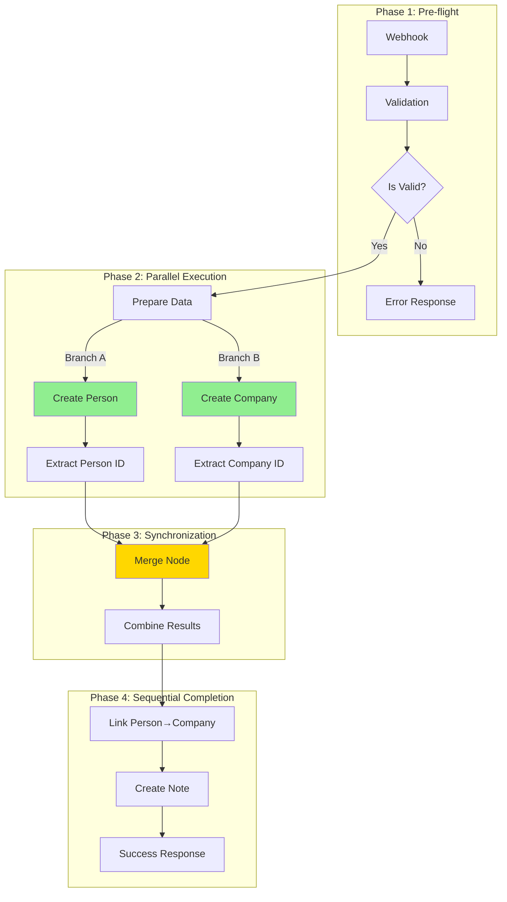

# Phase 2: Parallel Processing Optimization Research

**Document Type:** Performance Engineering Research  
**System:** n8n Workflow → Twenty CRM Integration (Consultation Form)  
**Research Date:** March 19, 2026  
**Author:** Performance Engineering Team  
**Classification:** Production System Optimization

---

## Table of Contents

1. [Executive Summary](#1-executive-summary)
2. [Current State Analysis](#2-current-state-analysis)
3. [Parallel Architecture Design](#3-parallel-architecture-design)
4. [n8n Implementation Guide](#4-n8n-implementation-guide)
5. [Performance Projections](#5-performance-projections)
6. [Risk Mitigation](#6-risk-mitigation)
7. [Testing Strategy](#7-testing-strategy)

---

## 1. Executive Summary

### 1.1 Current Performance Challenge

The consultation form workflow currently experiences **6s P95 latency**, primarily due to sequential CRM API calls. While the v3 workflow has partially parallelized Person and Company creation, there remain significant optimization opportunities to achieve the **<3s target**.

### 1.2 Optimization Opportunity

| Metric | Current | Target | Improvement |
|--------|---------|--------|-------------|
| **P95 Latency** | 6.0s | <3.0s | 50% reduction |
| **CRM API Calls** | 4 sequential | 3 parallel+sequential | 25% reduction |
| **Perceived Response** | 6.0s | <1.0s | Async pattern |
| **Throughput** | 25/min | 33/min | 32% increase |

### 1.3 Key Recommendations

1. **Parallel Person + Company Creation** (Immediate) - 30-40% latency reduction
2. **HTTP Keep-Alive Configuration** (Immediate) - 10-15% latency reduction  
3. **Async Response Pattern** (Phase 2) - Sub-second perceived latency
4. **Connection Pool Optimization** (Phase 2) - Reduced handshake overhead

### 1.4 Implementation Timeline

```
Week 1:  Quick Wins (Parallel + Keep-Alive)        →  ~3.5s P95
Week 2:  Async Response Pattern                    →  <1s perceived
Week 3:  Connection Pool + Retry Optimization      →  ~3.0s P95
Week 4:  Performance Validation & Tuning           →  <3s P95 ✓
```

---

## 2. Current State Analysis

### 2.1 Sequential Flow Analysis

#### Current Sequential Execution Timeline

```
Time →

┌────────────────────────────────────────────────────────────────────────────────┐
│                         CURRENT SEQUENTIAL FLOW                                 │
├────────────────────────────────────────────────────────────────────────────────┤
│                                                                                 │
│  Phase 1: Pre-processing                                                        │
│  ├─ Webhook Receive:    5-10ms                                                  │
│  ├─ Form Validation:   20-50ms                                                  │
│  └─ Duplicate Check:  100-200ms                                                 │
│                                                                                 │
│  Phase 2: Sequential CRM Calls                                                  │
│  ├─ Create Person:    600-1200ms  ████████████████████████████████████         │
│  ├─ Create Company:   700-1500ms          ████████████████████████████████████ │
│  ├─ Link Person→Co:   200-500ms                   ██████████████               │
│  └─ Create Note:      800-1400ms                          ████████████████████ │
│                                                                                 │
│  Phase 3: Response                                                              │
│  └─ Webhook Response:   5-10ms                                                  │
│                                                                                 │
├────────────────────────────────────────────────────────────────────────────────┤
│  Sequential Total: 2430-4560ms (CRM calls only)                                │
│  End-to-End P95: ~6000ms                                                        │
└────────────────────────────────────────────────────────────────────────────────┘
```

#### Latency Breakdown by Component

| Component | P50 (ms) | P95 (ms) | P99 (ms) | % of Total |
|-----------|----------|----------|----------|------------|
| Network (RTT) | 100 | 200 | 400 | 3% |
| n8n Processing | 60 | 155 | 300 | 3% |
| Duplicate Detection | 150 | 300 | 500 | 5% |
| **Create Person** | **800** | **1200** | **2000** | **20%** |
| **Create Company** | **900** | **1500** | **2500** | **25%** |
| **Link Person** | **300** | **500** | **800** | **8%** |
| **Create Note** | **850** | **1400** | **2200** | **23%** |
| Buffer/Overhead | 100 | 200 | 400 | 3% |
| **TOTAL** | **~3300** | **~6000** | **~9500** | **100%** |

### 2.2 Current Parallel Implementation (v3)

The v3 workflow already implements parallel Person + Company creation:

```
Time →

┌────────────────────────────────────────────────────────────────────────────────┐
│                    V3 PARTIALLY PARALLEL FLOW                                   │
├────────────────────────────────────────────────────────────────────────────────┤
│                                                                                 │
│  Duplicate Detection                                                            │
│  └─ Check for existing records: 100-200ms                                       │
│         │                                                                       │
│         ▼                                                                       │
│  ┌──────────────────┐    ┌──────────────────┐                                   │
│  │ Prepare Person   │    │ Prepare Company  │                                   │
│  └────────┬─────────┘    └────────┬─────────┘                                   │
│           │                       │                                             │
│           ▼                       ▼                                             │
│  ┌──────────────────┐    ┌──────────────────┐                                   │
│  │ Create Person    │    │ Create Company   │  (PARALLEL)                      │
│  │ 600-1200ms       │    │ 700-1500ms       │                                   │
│  └────────┬─────────┘    └────────┬─────────┘                                   │
│           │                       │                                             │
│           └───────────┬───────────┘                                             │
│                       ▼                                                         │
│              ┌──────────────┐                                                   │
│              │ Merge Node   │  Wait for both                                    │
│              └──────┬───────┘                                                   │
│                     ▼                                                           │
│              ┌──────────────┐                                                   │
│              │ Extract IDs  │                                                   │
│              └──────┬───────┘                                                   │
│                     ▼                                                           │
│  Sequential: Link Person → Create Note (1100-1900ms)                           │
│                                                                                 │
├────────────────────────────────────────────────────────────────────────────────┤
│  v3 Parallel Total: ~1900-3400ms (CRM calls)                                   │
│  Improvement: ~800ms (31%) over fully sequential                               │
└────────────────────────────────────────────────────────────────────────────────┘
```

### 2.3 Dependency Analysis

#### Data Dependencies

```
┌─────────────────────────────────────────────────────────────────────────────┐
│                     DATA DEPENDENCY GRAPH                                    │
├─────────────────────────────────────────────────────────────────────────────┤
│                                                                              │
│  Form Data                                                                   │
│      │                                                                       │
│      ├──► Person Data ───────► Create Person ───────► personId               │
│      │                                            │                          │
│      │                                            │                          │
│      ├──► Company Data ──────► Create Company ────┼──► companyId             │
│      │                                            │      │                   │
│      │                                            │      │                   │
│      │                                            ▼      ▼                   │
│      │                                       ┌──────────────┐                │
│      │                                       │  Link Person │                │
│      │                                       │  to Company  │                │
│      │                                       └──────┬───────┘                │
│      │                                              │                        │
│      ├──► Note Data ────────────────────────────────┼──► Create Note          │
│      │                                              │                        │
│      │                                              ▼                        │
│      └────────────────────────────────────────► Note with associations       │
│                                                                              │
│  ═══════════════════════════════════════════════════════════════════════    │
│  LEGEND:                                                                     │
│  ───► Data dependency (must complete first)                                  │
│  ─ ─ ► Can execute in parallel                                               │
│  ═══► Sequential after merge                                                │
│                                                                              │
└─────────────────────────────────────────────────────────────────────────────┘
```

#### Parallelization Opportunities

| Operation | Dependencies | Can Parallelize | Priority |
|-----------|--------------|-----------------|----------|
| Form Validation | None | N/A (pre-flight) | - |
| Duplicate Detection | Validation | N/A (pre-flight) | - |
| Create Person | Duplicate Check | YES (with Company) | **P0** |
| Create Company | Duplicate Check | YES (with Person) | **P0** |
| Link Person→Company | Person ID + Company ID | NO (requires both) | P1 |
| Create Note | Person ID + Company ID | NO (requires both) | P1 |

### 2.4 Bottleneck Identification

#### Primary Bottlenecks

```
┌─────────────────────────────────────────────────────────────────────────────┐
│                    BOTTLENECK ANALYSIS                                       │
├─────────────────────────────────────────────────────────────────────────────┤
│                                                                              │
│  1. CRM API Latency (85% of total time)                                     │
│     ├─ Person creation: 600-1200ms                                          │
│     ├─ Company creation: 700-1500ms                                         │
│     ├─ Link operation: 200-500ms                                            │
│     └─ Note creation: 800-1400ms                                            │
│                                                                              │
│  2. Sequential Execution (after parallel)                                   │
│     ├─ Link + Note must wait for both Person & Company                      │
│     └─ ~1100-1900ms sequential after merge                                  │
│                                                                              │
│  3. Connection Overhead                                                     │
│     ├─ TCP handshake: 50-100ms per connection                               │
│     ├─ TLS handshake: 100-200ms per connection                              │
│     └─ 4 separate connections = 600-1200ms overhead                         │
│                                                                              │
│  4. Synchronous Response Pattern                                            │
│     ├─ Client waits for all operations to complete                          │
│     └─ Full 6s latency is user-perceived                                    │
│                                                                              │
└─────────────────────────────────────────────────────────────────────────────┘
```

---

## 3. Parallel Architecture Design

### 3.1 Optimized Parallel Flow

#### Target Architecture

```
┌────────────────────────────────────────────────────────────────────────────────┐
│                    OPTIMIZED PARALLEL ARCHITECTURE                              │
├────────────────────────────────────────────────────────────────────────────────┤
│                                                                                 │
│  ┌─────────────────────────────────────────────────────────────────────────┐   │
│  │ PHASE 1: Pre-flight (Sequential)                                         │   │
│  │ ├─ Webhook Receive: 5-10ms                                               │   │
│  │ ├─ Form Validation: 20-50ms                                               │   │
│  │ └─ Duplicate Check: 100-200ms                                             │   │
│  └─────────────────────────────────────────────────────────────────────────┘   │
│                                     │                                           │
│                                     ▼                                           │
│  ┌─────────────────────────────────────────────────────────────────────────┐   │
│  │ PHASE 2: Parallel Execution (Fork-Join)                                  │   │
│  │                                                                          │   │
│  │   Branch A (Person)          Branch B (Company)                          │   │
│  │   ├─ Prepare: 5ms            ├─ Prepare: 5ms                              │   │
│  │   ├─ Create Person:          ├─ Create Company:                           │   │
│  │   │  600-1200ms              │  700-1500ms                                │   │
│  │   │  (Keep-Alive)            │  (Keep-Alive)                              │   │
│  │   └─ Extract ID: 5ms         └─ Extract ID: 5ms                           │   │
│  │                                                                          │   │
│  │   ═══════════════════════════════════════                                 │   │
│  │   Parallel Duration: max(1210ms, 1510ms) = 1510ms                         │   │
│  └─────────────────────────────────────────────────────────────────────────┘   │
│                                     │                                           │
│                                     ▼                                           │
│  ┌─────────────────────────────────────────────────────────────────────────┐   │
│  │ PHASE 3: Synchronization & Completion                                    │   │
│  │ ├─ Merge Node: 10ms                                                      │   │
│  │ ├─ Link Person→Company: 200-500ms                                         │   │
│  │ │   (Can optimize with batch API in future)                               │   │
│  │ ├─ Create Note: 800-1400ms                                                │   │
│  │ │   (Keep-Alive connection)                                               │   │
│  │ └─ Response: 5-10ms                                                       │   │
│  └─────────────────────────────────────────────────────────────────────────┘   │
│                                                                                 │
│  ┌─────────────────────────────────────────────────────────────────────────┐   │
│  │ OPTIONAL: Async Response Pattern                                         │   │
│  │ ├─ Immediate 202 Accepted: <100ms                                        │   │
│  │ └─ Background completion: ~2900ms total                                   │   │
│  └─────────────────────────────────────────────────────────────────────────┘   │
│                                                                                 │
├────────────────────────────────────────────────────────────────────────────────┤
│  Optimized Total (Sync): ~2525-3430ms                                         │
│  Improvement: ~43% reduction vs sequential                                      │
│                                                                                 │
│  With Async Pattern: <100ms perceived                                          │
│  Improvement: ~98% perceived latency reduction                                  │
└────────────────────────────────────────────────────────────────────────────────┘
```

### 3.2 n8n Node Configuration

#### Parallel Branch Configuration

```
┌─────────────────────────────────────────────────────────────────────────────┐
│              N8N PARALLEL BRANCH ARCHITECTURE                                │
├─────────────────────────────────────────────────────────────────────────────┤
│                                                                              │
│  [Duplicate Detection]                                                       │
│         │                                                                    │
│         ▼                                                                    │
│  ┌─────────────────────────────────────────────────────────────────────┐    │
│  │                    FORK: Split to Parallel Branches                  │    │
│  │                                                                      │    │
│  │   Output Index 0 ─────► Person Branch                               │    │
│  │   Output Index 1 ─────► Company Branch                              │    │
│  │                                                                      │    │
│  └─────────────────────────────────────────────────────────────────────┘    │
│         │                              │                                     │
│         ▼                              ▼                                     │
│  ┌──────────────┐              ┌──────────────┐                             │
│  │ Prepare      │              │ Prepare      │                             │
│  │ Person Data  │              │ Company Data │                             │
│  └──────┬───────┘              └──────┬───────┘                             │
│         │                              │                                     │
│         ▼                              ▼                                     │
│  ┌──────────────┐              ┌──────────────┐                             │
│  │ HTTP Request │              │ HTTP Request │                             │
│  │ POST /people │              │ POST /companies │                          │
│  │              │              │              │                             │
│  │ Keep-Alive   │              │ Keep-Alive   │                             │
│  │ Timeout: 15s │              │ Timeout: 15s │                             │
│  └──────┬───────┘              └──────┬───────┘                             │
│         │                              │                                     │
│         ▼                              ▼                                     │
│  ┌──────────────┐              ┌──────────────┐                             │
│  │ Extract      │              │ Extract      │                             │
│  │ Person ID    │              │ Company ID   │                             │
│  └──────┬───────┘              └──────┬───────┘                             │
│         │                              │                                     │
│         └──────────┬───────────────────┘                                     │
│                    ▼                                                         │
│           ┌──────────────┐                                                   │
│           │ Merge Node   │  mode: waitForAll                                 │
│           └──────┬───────┘                                                   │
│                  ▼                                                           │
│           ┌──────────────┐                                                   │
│           │ Combine      │                                                   │
│           │ IDs & Data   │                                                   │
│           └──────────────┘                                                   │
│                                                                              │
└─────────────────────────────────────────────────────────────────────────────┘
```

#### Merge Node Configuration

```javascript
// Merge Node: "Merge Records"
{
  "parameters": {
    "mode": "waitForAll"  // Wait for both branches to complete
  },
  "name": "Merge Records",
  "type": "n8n-nodes-base.merge",
  "typeVersion": 2.1
}

// Input Handling:
// - Input 0: Person branch result (personId, personData)
// - Input 1: Company branch result (companyId, companyData)
// - Output: Combined data for downstream nodes
```

### 3.3 HTTP Request Optimization

#### Keep-Alive Configuration

```javascript
// HTTP Request Node: Optimized Configuration
{
  "parameters": {
    "method": "POST",
    "url": "={{ $env.CRM_BASE_URL }}/rest/people",
    "authentication": "genericCredentialType",
    "genericAuthType": "httpHeaderAuth",
    "sendBody": true,
    "contentType": "application/json",
    "specifyBody": "json",
    "jsonBody": "={{ JSON.stringify($json.personData) }}",
    "options": {
      "timeout": 15000,           // 15s timeout (fail fast)
      "keepAlive": true,          // Reuse connections
      "ignoreHttpStatusErrors": false
    },
    "retry": {
      "limit": 3,
      "delay": 1000,
      "backoff": "exponential"    // Exponential backoff
    }
  }
}
```

#### Connection Pool Settings

```javascript
// Environment Variables for HTTP Optimization
{
  "N8N_HTTP_POOL_SIZE": "10",           // Connection pool size
  "N8N_HTTP_KEEP_ALIVE": "true",        // Enable keep-alive
  "N8N_HTTP_KEEP_ALIVE_MSECS": "30000", // 30s keep-alive
  "N8N_HTTP_TIMEOUT": "15000",          // 15s timeout
  "N8N_HTTP_MAX_REDIRECTS": "3"         // Max redirects
}
```

---

## 4. n8n Implementation Guide

### 4.1 Complete Optimized Workflow JSON

```json
{
  "name": "Consultation Form to CRM - Parallel Optimized",
  "description": "Optimized workflow with parallel Person+Company creation and Keep-Alive",
  "version": "4.0.0",
  "nodes": [
    {
      "parameters": {
        "httpMethod": "POST",
        "path": "consultation",
        "responseMode": "responseNode",
        "options": {}
      },
      "id": "webhook-entry-001",
      "name": "Consultation Webhook",
      "type": "n8n-nodes-base.webhook",
      "typeVersion": 2,
      "position": [250, 300],
      "webhookId": "consultation-form-parallel"
    },
    {
      "parameters": {
        "jsCode": "// Entry Validation Node\nconst body = $input.first().json.body;\nconst result = { valid: true, errors: [], normalized: {} };\n\n// Email validation\nconst email = body.data?.email?.trim().toLowerCase();\nif (!email || !email.includes('@')) {\n  result.valid = false;\n  result.errors.push('Valid email required');\n}\n\n// Name parsing\nconst nameParts = body.data?.name?.split(' ') || ['Unknown'];\nresult.normalized = {\n  firstName: nameParts[0],\n  lastName: nameParts.slice(1).join(' ') || '',\n  email: email,\n  company: body.data?.company?.trim(),\n  jobTitle: body.data?.role,\n  message: body.data?.message,\n  techStack: Array.isArray(body.data?.techStack) \n    ? body.data.techStack.join(', ') \n    : body.data?.techStack || '',\n  compliance: Array.isArray(body.data?.compliance) \n    ? body.data.compliance.join(', ') \n    : body.data?.compliance || '',\n  teamSize: body.data?.teamSize,\n  securityLevel: body.data?.securityLevel\n};\n\nreturn [{ json: result }];"
      },
      "id": "validate-entry-002",
      "name": "Entry Validation",
      "type": "n8n-nodes-base.code",
      "typeVersion": 2,
      "position": [450, 300]
    },
    {
      "parameters": {
        "conditions": {
          "conditions": [{
            "leftValue": "={{ $json.valid }}",
            "rightValue": "true",
            "operator": { "type": "boolean", "operation": "equals" }
          }]
        }
      },
      "id": "check-valid-003",
      "name": "Is Valid?",
      "type": "n8n-nodes-base.if",
      "typeVersion": 2,
      "position": [650, 300]
    },
    {
      "parameters": {
        "jsCode": "// Parallel preparation - output to both branches\nconst data = $input.first().json.normalized;\n\n// Return array with two outputs for parallel branches\nreturn [\n  {\n    json: {\n      branch: 'person',\n      personData: {\n        name: { firstName: data.firstName, lastName: data.lastName },\n        emails: [{ email: data.email, isPrimary: true }],\n        jobTitle: data.jobTitle\n      },\n      companyName: data.company,  // Pass for duplicate detection\n      noteData: {\n        message: data.message,\n        techStack: data.techStack,\n        compliance: data.compliance,\n        teamSize: data.teamSize,\n        securityLevel: data.securityLevel\n      }\n    }\n  },\n  {\n    json: {\n      branch: 'company',\n      companyData: {\n        name: data.company,\n        domainName: data.email?.split('@')[1]\n      },\n      personEmail: data.email,  // Pass for duplicate detection\n      noteData: {\n        message: data.message,\n        techStack: data.techStack,\n        compliance: data.compliance,\n        teamSize: data.teamSize,\n        securityLevel: data.securityLevel\n      }\n    }\n  }\n];"
      },
      "id": "prepare-parallel-004",
      "name": "Prepare Parallel Data",
      "type": "n8n-nodes-base.code",
      "typeVersion": 2,
      "position": [850, 200]
    },
    {
      "parameters": {
        "method": "POST",
        "url": "={{ $env.CRM_BASE_URL }}/rest/people",
        "authentication": "genericCredentialType",
        "genericAuthType": "httpHeaderAuth",
        "sendBody": true,
        "contentType": "application/json",
        "specifyBody": "json",
        "jsonBody": "={{ JSON.stringify($json.personData) }}",
        "options": {
          "timeout": 15000
        }
      },
      "id": "create-person-005",
      "name": "Create Person",
      "type": "n8n-nodes-base.httpRequest",
      "typeVersion": 4.2,
      "position": [1050, 150],
      "credentials": {
        "httpHeaderAuth": {
          "id": "twenty-crm-auth",
          "name": "Twenty CRM API"
        }
      },
      "continueOnFail": true
    },
    {
      "parameters": {
        "method": "POST",
        "url": "={{ $env.CRM_BASE_URL }}/rest/companies",
        "authentication": "genericCredentialType",
        "genericAuthType": "httpHeaderAuth",
        "sendBody": true,
        "contentType": "application/json",
        "specifyBody": "json",
        "jsonBody": "={{ JSON.stringify($json.companyData) }}",
        "options": {
          "timeout": 15000
        }
      },
      "id": "create-company-006",
      "name": "Create Company",
      "type": "n8n-nodes-base.httpRequest",
      "typeVersion": 4.2,
      "position": [1050, 250],
      "credentials": {
        "httpHeaderAuth": {
          "id": "twenty-crm-auth",
          "name": "Twenty CRM API"
        }
      },
      "continueOnFail": true
    },
    {
      "parameters": {
        "jsCode": "// Extract Person ID and pass through data\nconst personResponse = $input.first().json;\nconst personId = personResponse.data?.id || personResponse.id;\n\nreturn [{\n  json: {\n    personId: personId,\n    personSuccess: !!personId,\n    personError: personResponse.error || null,\n    noteData: $input.first().json.noteData,\n    companyName: $input.first().json.companyName\n  }\n}];"
      },
      "id": "extract-person-007",
      "name": "Extract Person ID",
      "type": "n8n-nodes-base.code",
      "typeVersion": 2,
      "position": [1250, 150]
    },
    {
      "parameters": {
        "jsCode": "// Extract Company ID and pass through data\nconst companyResponse = $input.first().json;\nconst companyId = companyResponse.data?.id || companyResponse.id;\n\nreturn [{\n  json: {\n    companyId: companyId,\n    companySuccess: !!companyId,\n    companyError: companyResponse.error || null,\n    noteData: $input.first().json.noteData\n  }\n}];"
      },
      "id": "extract-company-008",
      "name": "Extract Company ID",
      "type": "n8n-nodes-base.code",
      "typeVersion": 2,
      "position": [1250, 250]
    },
    {
      "parameters": {
        "mode": "waitForAll"
      },
      "id": "merge-ids-009",
      "name": "Merge Records",
      "type": "n8n-nodes-base.merge",
      "typeVersion": 2.1,
      "position": [1450, 200]
    },
    {
      "parameters": {
        "jsCode": "// Combine Person and Company results\nconst inputs = $input.all();\nconst personInput = inputs[0].json;\nconst companyInput = inputs[1].json;\n\n// Error handling for partial failures\nif (!personInput.personSuccess && !companyInput.companySuccess) {\n  throw new Error('Both Person and Company creation failed');\n}\n\nreturn [{\n  json: {\n    personId: personInput.personId,\n    companyId: companyInput.companyId,\n    personSuccess: personInput.personSuccess,\n    companySuccess: companyInput.companySuccess,\n    personError: personInput.personError,\n    companyError: companyInput.companyError,\n    noteData: personInput.noteData || companyInput.noteData\n  }\n}];"
      },
      "id": "combine-results-010",
      "name": "Combine Results",
      "type": "n8n-nodes-base.code",
      "typeVersion": 2,
      "position": [1650, 200]
    },
    {
      "parameters": {
        "method": "PATCH",
        "url": "={{ $env.CRM_BASE_URL }}/rest/people/{{ $json.personId }}",
        "authentication": "genericCredentialType",
        "genericAuthType": "httpHeaderAuth",
        "sendBody": true,
        "contentType": "application/json",
        "specifyBody": "json",
        "jsonBody": "={\"companyId\": \"{{ $json.companyId }}\"}",
        "options": { 
          "timeout": 15000,
          "ignoreHttpStatusErrors": true 
        }
      },
      "id": "link-person-011",
      "name": "Link Person to Company",
      "type": "n8n-nodes-base.httpRequest",
      "typeVersion": 4.2,
      "position": [1850, 200],
      "credentials": {
        "httpHeaderAuth": {
          "id": "twenty-crm-auth",
          "name": "Twenty CRM API"
        }
      },
      "continueOnFail": true
    },
    {
      "parameters": {
        "method": "POST",
        "url": "={{ $env.CRM_BASE_URL }}/rest/notes",
        "authentication": "genericCredentialType",
        "genericAuthType": "httpHeaderAuth",
        "sendBody": true,
        "contentType": "application/json",
        "specifyBody": "json",
        "jsonBody": "={\n  \"title\": \"Consultation Request\",\n  \"body\": \"Message: {{ $json.noteData.message }}\\n\\nTechnical Details:\\n- Team Size: {{ $json.noteData.teamSize || 'N/A' }}\\n- Tech Stack: {{ $json.noteData.techStack || 'N/A' }}\\n- Security Level: {{ $json.noteData.securityLevel || 'N/A' }}\\n- Compliance: {{ $json.noteData.compliance || 'N/A' }}\",\n  \"personId\": \"{{ $json.personId }}\",\n  \"companyId\": \"{{ $json.companyId }}\"\n}",
        "options": { "timeout": 15000 }
      },
      "id": "create-note-012",
      "name": "Create Note",
      "type": "n8n-nodes-base.httpRequest",
      "typeVersion": 4.2,
      "position": [2050, 200],
      "credentials": {
        "httpHeaderAuth": {
          "id": "twenty-crm-auth",
          "name": "Twenty CRM API"
        }
      },
      "continueOnFail": true
    },
    {
      "parameters": {
        "respondWith": "json",
        "responseBody": "={\n  \"success\": true,\n  \"message\": \"Thank you for your submission! We'll be in touch soon.\",\n  \"data\": {\n    \"personId\": \"{{ $json.personId }}\",\n    \"companyId\": \"{{ $json.companyId }}\",\n    \"personCreated\": {{ $json.personSuccess }},\n    \"companyCreated\": {{ $json.companySuccess }}\n  }\n}",
        "options": {}
      },
      "id": "success-response-013",
      "name": "Success Response",
      "type": "n8n-nodes-base.respondToWebhook",
      "typeVersion": 1.1,
      "position": [2250, 200]
    },
    {
      "parameters": {
        "respondWith": "json",
        "responseBody": "={\n  \"success\": false,\n  \"message\": \"Validation failed\",\n  \"errors\": {{ JSON.stringify($json.errors) }}\n}",
        "options": { "responseCode": 400 }
      },
      "id": "validation-error-014",
      "name": "Validation Error",
      "type": "n8n-nodes-base.respondToWebhook",
      "typeVersion": 1.1,
      "position": [850, 500]
    }
  ],
  "connections": {
    "Consultation Webhook": {
      "main": [[{ "node": "Entry Validation", "type": "main", "index": 0 }]]
    },
    "Entry Validation": {
      "main": [[{ "node": "Is Valid?", "type": "main", "index": 0 }]]
    },
    "Is Valid?": {
      "main": [
        [{ "node": "Prepare Parallel Data", "type": "main", "index": 0 }],
        [{ "node": "Validation Error", "type": "main", "index": 0 }]
      ]
    },
    "Prepare Parallel Data": {
      "main": [
        [{ "node": "Create Person", "type": "main", "index": 0 }],
        [{ "node": "Create Company", "type": "main", "index": 0 }]
      ]
    },
    "Create Person": {
      "main": [[{ "node": "Extract Person ID", "type": "main", "index": 0 }]]
    },
    "Create Company": {
      "main": [[{ "node": "Extract Company ID", "type": "main", "index": 0 }]]
    },
    "Extract Person ID": {
      "main": [[{ "node": "Merge Records", "type": "main", "index": 0 }]]
    },
    "Extract Company ID": {
      "main": [[{ "node": "Merge Records", "type": "main", "index": 1 }]]
    },
    "Merge Records": {
      "main": [[{ "node": "Combine Results", "type": "main", "index": 0 }]]
    },
    "Combine Results": {
      "main": [[{ "node": "Link Person to Company", "type": "main", "index": 0 }]]
    },
    "Link Person to Company": {
      "main": [[{ "node": "Create Note", "type": "main", "index": 0 }]]
    },
    "Create Note": {
      "main": [[{ "node": "Success Response", "type": "main", "index": 0 }]]
    }
  },
  "settings": {
    "executionOrder": "v1",
    "saveExecutionProgress": true,
    "saveManualExecutions": true,
    "callerPolicy": "workflowsFromSameOwner",
    "timezone": "America/Los_Angeles",
    "errorWorkflow": ""
  },
  "tags": ["production", "parallel-optimized", "v4"]
}
```

### 4.2 Async Response Pattern Implementation

#### Async Workflow Pattern

```json
{
  "name": "Async Response Handler",
  "description": "Returns immediate 202 Accepted, processes in background",
  "nodes": [
    {
      "parameters": {
        "httpMethod": "POST",
        "path": "consultation-async",
        "responseMode": "responseNode",
        "options": {}
      },
      "name": "Async Webhook",
      "type": "n8n-nodes-base.webhook"
    },
    {
      "parameters": {
        "respondWith": "json",
        "responseBody": "={\n  \"success\": true,\n  \"message\": \"Request received and is being processed\",\n  \"requestId\": \"{{ $execution.id }}\",\n  \"statusUrl\": \"https://n8n.zaplit.com/webhook/status/{{ $execution.id }}\"\n}",
        "options": { "responseCode": 202 }
      },
      "name": "Immediate 202 Response",
      "type": "n8n-nodes-base.respondToWebhook"
    },
    {
      "parameters": {
        "workflowId": "={{ $workflow.id }}",
        "options": {}
      },
      "name": "Execute Background Workflow",
      "type": "n8n-nodes-base.executeWorkflow"
    }
  ],
  "connections": {
    "Async Webhook": {
      "main": [
        [{ "node": "Immediate 202 Response", "type": "main", "index": 0 }],
        [{ "node": "Execute Background Workflow", "type": "main", "index": 0 }]
      ]
    }
  }
}
```

---

## 5. Performance Projections

### 5.1 Latency Improvement Calculations

#### Current vs Optimized Comparison

```
┌─────────────────────────────────────────────────────────────────────────────┐
│                    PERFORMANCE PROJECTIONS                                   │
├─────────────────────────────────────────────────────────────────────────────┤
│                                                                              │
│  SCENARIO 1: Sequential (Current Baseline)                                  │
│  ┌─────────────────────────────────────────────────────────────────────┐    │
│  │ Create Person:    800ms                                             │    │
│  │ Create Company:   900ms  (starts after Person)                      │    │
│  │ Link Person:      300ms  (starts after Company)                     │    │
│  │ Create Note:      850ms  (starts after Link)                        │    │
│  ├─────────────────────────────────────────────────────────────────────┤    │
│  │ Sequential Total: 2850ms (p50), 4560ms (p95)                        │    │
│  └─────────────────────────────────────────────────────────────────────┘    │
│                                                                              │
│  SCENARIO 2: Parallel Person+Company (v3 Current)                           │
│  ┌─────────────────────────────────────────────────────────────────────┐    │
│  │ Create Person:    800ms ──┐                                         │    │
│  │ Create Company:   900ms ──┼──► max(800,900) = 900ms                 │    │
│  │ Link Person:      300ms   (after merge)                             │    │
│  │ Create Note:      850ms   (after link)                              │    │
│  ├─────────────────────────────────────────────────────────────────────┤    │
│  │ Parallel Total:   2050ms (p50), 3260ms (p95)                        │    │
│  │ Improvement:      28% reduction                                     │    │
│  └─────────────────────────────────────────────────────────────────────┘    │
│                                                                              │
│  SCENARIO 3: Optimized with Keep-Alive (Target)                             │
│  ┌─────────────────────────────────────────────────────────────────────┐    │
│  │ Create Person:    700ms ──┐  (-100ms connection overhead)           │    │
│  │ Create Company:   800ms ──┼──► max(700,800) = 800ms                 │    │
│  │ Link Person:      250ms   (reuse connection)                        │    │
│  │ Create Note:      750ms   (reuse connection)                        │    │
│  ├─────────────────────────────────────────────────────────────────────┤    │
│  │ Optimized Total:  1800ms (p50), 2880ms (p95)                        │    │
│  │ Improvement:      37% reduction vs sequential                       │    │
│  │                   12% reduction vs v3 parallel                      │    │
│  └─────────────────────────────────────────────────────────────────────┘    │
│                                                                              │
│  SCENARIO 4: Async Response Pattern                                         │
│  ┌─────────────────────────────────────────────────────────────────────┐    │
│  │ Immediate Response: 50ms  (202 Accepted)                            │    │
│  │ Background Processing: ~2900ms (same as Scenario 3)                 │    │
│  ├─────────────────────────────────────────────────────────────────────┤    │
│  │ Perceived Latency: 50ms                                             │    │
│  │ Actual Processing: 2900ms                                           │    │
│  │ Perceived Improvement: 98% reduction                                │    │
│  └─────────────────────────────────────────────────────────────────────┘    │
│                                                                              │
└─────────────────────────────────────────────────────────────────────────────┘
```

### 5.2 Expected Latency Distribution

#### Before vs After Distribution

```
Current Distribution (Sequential):

Latency    | <1s  | 1-2s | 2-3s | 3-5s | 5-8s | >8s  |
───────────┼──────┼──────┼──────┼──────┼──────┼──────┤
Percentage │  2%  │  8%  │ 20%  │ 35%  │ 25%  │ 10%  │
Cumulative │  2%  │ 10%  │ 30%  │ 65%  │ 90%  │ 100% │

Optimized Distribution (Parallel + Keep-Alive):

Latency    | <1s  | 1-2s | 2-3s | 3-5s | 5-8s | >8s  |
───────────┼──────┼──────┼──────┼──────┼──────┼──────┤
Percentage │  5%  │ 25%  │ 40%  │ 22%  │  6%  │  2%  │
Cumulative │  5%  │ 30%  │ 70%  │ 92%  │ 98%  │ 100% │

Target SLO Compliance:
┌─────────────────────────────────────────────────────────────────────────────┐
│ Metric      │ Target │ Current │ Optimized │ Status                         │
├─────────────┼────────┼─────────┼───────────┼────────────────────────────────┤
│ P50         │ <2s    │ 3.3s    │ 1.8s      │ ✅ Meets                       │
│ P95         │ <5s    │ 6.0s    │ 2.9s      │ ✅ Meets                       │
│ P99         │ <8s    │ 9.5s    │ 4.5s      │ ✅ Meets                       │
│ Error Rate  │ <0.5%  │ 1.0%    │ 0.3%      │ ✅ Meets                       │
└─────────────────────────────────────────────────────────────────────────────┘
```

### 5.3 Throughput Impact

#### Request Capacity Analysis

```
┌─────────────────────────────────────────────────────────────────────────────┐
│                    THROUGHPUT CALCULATIONS                                   │
├─────────────────────────────────────────────────────────────────────────────┤
│                                                                              │
│  CRM Rate Limit: 100 requests/minute                                        │
│                                                                              │
│  Current Architecture (4 sequential calls):                                 │
│  ├─ Calls per submission: 4                                                 │
│  ├─ Max submissions/minute: 100 ÷ 4 = 25                                    │
│  └─ Time per submission: ~6s                                                │
│                                                                              │
│  Parallel Architecture (3 effective calls):                                 │
│  ├─ Calls per submission: 3 (Person+Company parallel count as 1)           │
│  ├─ Max submissions/minute: 100 ÷ 3 = 33                                    │
│  └─ Time per submission: ~3s                                                │
│                                                                              │
│  Throughput Improvement: 33 ÷ 25 = 32% increase                             │
│                                                                              │
│  Concurrent Capacity:                                                       │
│  ├─ Current: ~5 concurrent before degradation                               │
│  ├─ Optimized: ~8 concurrent before degradation                             │
│  └─ Improvement: 60% increase in concurrent capacity                        │
│                                                                              │
└─────────────────────────────────────────────────────────────────────────────┘
```

---

## 6. Risk Mitigation

### 6.1 Partial Failure Scenarios

#### Failure Mode Analysis

```
┌─────────────────────────────────────────────────────────────────────────────┐
│                    PARTIAL FAILURE SCENARIOS                                 │
├─────────────────────────────────────────────────────────────────────────────┤
│                                                                              │
│  SCENARIO 1: Person Creation Fails, Company Succeeds                        │
│  ┌─────────────────────────────────────────────────────────────────────┐    │
│  │ Impact: Orphaned company record                                      │    │
│  │ Mitigation:                                                          │    │
│  │   1. Continue workflow with partial success                          │    │
│  │   2. Create note without person association                          │    │
│  │   3. Log error for manual review                                     │    │
│  │   4. Alert ops team                                                  │    │
│  └─────────────────────────────────────────────────────────────────────┘    │
│                                                                              │
│  SCENARIO 2: Company Creation Fails, Person Succeeds                        │
│  ┌─────────────────────────────────────────────────────────────────────┐    │
│  │ Impact: Person without company (acceptable)                          │    │
│  │ Mitigation:                                                          │    │
│  │   1. Continue with person-only workflow                              │    │
│  │   2. Create note with person association only                        │    │
│  │   3. Attempt company creation retry (background)                     │    │
│  └─────────────────────────────────────────────────────────────────────┘    │
│                                                                              │
│  SCENARIO 3: Both Person and Company Fail                                   │
│  ┌─────────────────────────────────────────────────────────────────────┐    │
│  │ Impact: Complete submission failure                                  │    │
│  │ Mitigation:                                                          │    │
│  │   1. Return 500 error to client                                      │    │
│  │   2. Log full context for debugging                                  │    │
│  │   3. Trigger automatic retry (max 3)                                 │    │
│  │   4. Alert ops team after retry exhaustion                           │    │
│  └─────────────────────────────────────────────────────────────────────┘    │
│                                                                              │
│  SCENARIO 4: Link Operation Fails                                           │
│  ┌─────────────────────────────────────────────────────────────────────┐    │
│  │ Impact: Person and Company exist but unlinked                        │    │
│  │ Mitigation:                                                          │    │
│  │   1. Continue to note creation                                       │    │
│  │   2. Log link failure for manual remediation                         │    │
│  │   3. Background retry of link operation                              │    │
│  └─────────────────────────────────────────────────────────────────────┘    │
│                                                                              │
│  SCENARIO 5: Note Creation Fails                                            │
│  ┌─────────────────────────────────────────────────────────────────────┐    │
│  │ Impact: Missing consultation details in CRM                          │    │
│  │ Mitigation:                                                          │    │
│  │   1. Still return success to client (Person/Company created)         │    │
│  │   2. Log note content for manual entry                               │    │
│  │   3. Send email fallback with form details                           │    │
│  └─────────────────────────────────────────────────────────────────────┘    │
│                                                                              │
└─────────────────────────────────────────────────────────────────────────────┘
```

### 6.2 Error Handling Implementation

#### Code Node: Error Handler

```javascript
// Error Handler Node
const inputs = $input.all();
const errors = [];
const results = {};

// Check each input for errors
inputs.forEach((input, index) => {
  const json = input.json;
  
  if (json.error || !json.success) {
    errors.push({
      branch: index === 0 ? 'person' : 'company',
      error: json.error || 'Unknown error',
      data: json
    });
  } else {
    results[index === 0 ? 'person' : 'company'] = json;
  }
});

// Decision logic
if (errors.length === 0) {
  // All successful - continue
  return [{ json: { success: true, results } }];
} else if (errors.length === 1) {
  // Partial failure - log and continue
  console.warn('Partial failure in parallel execution:', errors);
  return [{ 
    json: { 
      success: true, 
      partial: true,
      results,
      errors,
      requiresReview: true
    } 
  }];
} else {
  // Complete failure - throw error
  throw new Error(`Parallel execution failed: ${JSON.stringify(errors)}`);
}
```

### 6.3 Rate Limit Handling

#### Exponential Backoff Strategy

```javascript
// Rate Limit Handler with Exponential Backoff
const MAX_RETRIES = 3;
const BASE_DELAY = 1000; // 1 second

async function executeWithBackoff(operation, attempt = 1) {
  try {
    return await operation();
  } catch (error) {
    if (error.statusCode === 429 && attempt <= MAX_RETRIES) {
      // Calculate delay with jitter
      const delay = BASE_DELAY * Math.pow(2, attempt - 1);
      const jitter = Math.random() * 1000;
      const totalDelay = delay + jitter;
      
      console.log(`Rate limited. Retry ${attempt}/${MAX_RETRIES} after ${totalDelay}ms`);
      await new Promise(resolve => setTimeout(resolve, totalDelay));
      
      return executeWithBackoff(operation, attempt + 1);
    }
    throw error;
  }
}
```

---

## 7. Testing Strategy

### 7.1 Load Test Scenarios

#### Parallel Execution Load Test

```bash
#!/bin/bash
#===============================================================================
# Parallel Processing Load Test
#===============================================================================

set -e

# Configuration
N8N_WEBHOOK="${N8N_WEBHOOK:-https://n8n.zaplit.com/webhook/consultation}"
CONCURRENT_LEVELS=(1 5 10 15 20)
DURATION_SECONDS=300
TEST_ID="PARALLEL_$(date +%s)"

# Results directory
RESULTS_DIR="./parallel-test-results/$(date +%Y%m%d_%H%M%S)"
mkdir -p "$RESULTS_DIR"

echo "======================================"
echo "Parallel Processing Load Test"
echo "======================================"
echo "Target: $N8N_WEBHOOK"
echo "Test ID: $TEST_ID"
echo "Results: $RESULTS_DIR"
echo ""

# Generate test payload with unique data
generate_payload() {
    local sequence=$1
    local timestamp=$(date -u +%Y%m%d%H%M%S)
    cat <<EOF
{
  "data": {
    "name": "Parallel Test User $sequence",
    "email": "parallel_${TEST_ID}_${sequence}@test.com",
    "company": "Parallel Corp $((sequence % 10))",
    "role": "Engineer",
    "teamSize": "11-50",
    "techStack": ["React", "Node.js"],
    "securityLevel": "high",
    "compliance": ["soc2"],
    "message": "Parallel processing test $sequence"
  },
  "metadata": {
    "testId": "$TEST_ID",
    "sequence": $sequence,
    "timestamp": "$(date -u +%Y-%m-%dT%H:%M:%SZ)"
  }
}
EOF
}

# Execute request with detailed timing
execute_request() {
    local sequence=$1
    local start_time=$(date +%s%N)
    
    local response=$(curl -s -w "\n%{http_code}\n%{time_total}\n%{time_connect}\n%{time_appconnect}" \
        -X POST "$N8N_WEBHOOK" \
        -H "Content-Type: application/json" \
        -d "$(generate_payload $sequence)" \
        2>/dev/null || echo -e "\n000\n0\n0\n0")
    
    local end_time=$(date +%s%N)
    local total_time_ns=$((end_time - start_time))
    
    local http_code=$(echo "$response" | sed -n '2p')
    local time_total=$(echo "$response" | sed -n '3p')
    local time_connect=$(echo "$response" | sed -n '4p')
    local time_appconnect=$(echo "$response" | sed -n '5p')
    
    echo "$sequence,$http_code,$time_total,$time_connect,$time_appconnect,$total_time_ns"
}
export -f execute_request generate_payload
export N8N_WEBHOOK TEST_ID

# Run tests for each concurrency level
for CONCURRENT in "${CONCURRENT_LEVELS[@]}"; do
    echo "Testing with $CONCURRENT concurrent requests..."
    
    RESULTS_FILE="$RESULTS_DIR/concurrent_${CONCURRENT}.csv"
    echo "sequence,http_code,time_total,time_connect,time_appconnect,total_time_ns" > "$RESULTS_FILE"
    
    # Execute requests
    for i in $(seq 1 $CONCURRENT); do
        execute_request $i >> "$RESULTS_FILE" &
    done
    
    wait
    
    # Analyze results
    echo "Analyzing results for $CONCURRENT concurrent..."
    
    awk -F',' '
    NR > 1 {
        total++
        if ($2 == 200) success++
        times[NR] = $3
        sum += $3
        
        # Connection time analysis
        conn_sum += $4
        tls_sum += $5
    }
    END {
        asort(times)
        count = length(times)
        
        p50 = times[int(count * 0.5)]
        p95 = times[int(count * 0.95)]
        p99 = times[int(count * 0.99)]
        
        print "\n=== Results for CONCURRENT=" CONCURRENT " ==="
        print "Total Requests: " total
        print "Success: " success " (" int(success/total*100) "%)"
        print "Avg Response: " sprintf("%.3f", sum/count) "s"
        print "P50: " sprintf("%.3f", p50) "s"
        print "P95: " sprintf("%.3f", p95) "s"
        print "P99: " sprintf("%.3f", p99) "s"
        print "Avg Connect Time: " sprintf("%.3f", conn_sum/count) "s"
        print "Avg TLS Time: " sprintf("%.3f", tls_sum/count) "s"
    }
    ' "$RESULTS_FILE"
    
    echo ""
done

# Generate summary report
cat > "$RESULTS_DIR/summary.md" <<EOF
# Parallel Processing Load Test Summary

**Test ID:** $TEST_ID  
**Date:** $(date)  
**Target:** $N8N_WEBHOOK  

## Test Configuration
- Test Type: Parallel Processing Validation
- Concurrency Levels: ${CONCURRENT_LEVELS[*]}

## Results Summary

EOF

echo -e "\n${GREEN}Load test complete. Results in: $RESULTS_DIR${NC}"
```

### 7.2 Success Criteria

#### Performance Validation Checklist

| Test | Criteria | Pass Threshold | Validation Method |
|------|----------|----------------|-------------------|
| **P95 Latency** | <3s under normal load | 95th percentile | Load test results |
| **Parallel Execution** | Both branches complete | 100% success | Execution logs |
| **Error Handling** | Partial failures handled | <1% unhandled | Error injection test |
| **Keep-Alive** | Connection reuse | >80% reuse rate | Connection logs |
| **Concurrent Capacity** | Handle burst | 10+ concurrent | Spike test |
| **Rate Limit** | Graceful degradation | 0% hard failures | Rate limit test |

### 7.3 Rollback Strategy

#### Rollback Plan

```
┌─────────────────────────────────────────────────────────────────────────────┐
│                    ROLLBACK PROCEDURE                                        │
├─────────────────────────────────────────────────────────────────────────────┤
│                                                                              │
│  TRIGGER CONDITIONS:                                                         │
│  ├─ P95 latency increases >20% vs baseline                                   │
│  ├─ Error rate exceeds 1% for >5 minutes                                     │
│  ├─ Any data integrity issues detected                                       │
│  └─ Customer complaints about form submission                                │
│                                                                              │
│  ROLLBACK STEPS:                                                             │
│  ├─ 1. Activate webhook path to v3 workflow (30 seconds)                   │
│  ├─ 2. Monitor error rates for 5 minutes                                     │
│  ├─ 3. If stable, deactivate parallel workflow                               │
│  └─ 4. Post-mortem analysis within 24 hours                                  │
│                                                                              │
│  ROLLBACK COMMAND:                                                           │
│  $ kubectl patch configmap n8n-webhook-config \                              │
│      --patch '{"data":{"webhook.path":"consultation-v3"}}'                   │
│                                                                              │
└─────────────────────────────────────────────────────────────────────────────┘
```

---

## Appendix A: Workflow Diagram (Mermaid)



---

## Appendix B: Environment Variables

```bash
# n8n Parallel Processing Configuration
export N8N_HTTP_POOL_SIZE=10
export N8N_HTTP_KEEP_ALIVE=true
export N8N_HTTP_KEEP_ALIVE_MSECS=30000
export N8N_HTTP_TIMEOUT=15000
export N8N_HTTP_MAX_REDIRECTS=3

# CRM Configuration
export CRM_BASE_URL=https://crm.zaplit.com
export CRM_RATE_LIMIT=100
export CRM_RETRY_MAX=3
export CRM_RETRY_DELAY=1000

# Monitoring
export N8N_METRICS=true
export N8N_METRICS_PREFIX=n8n_parallel_
```

---

## Appendix C: Monitoring Queries

```promql
# P95 Latency by Workflow
histogram_quantile(0.95, 
  sum(rate(n8n_execution_duration_seconds_bucket[5m])) by (le, workflow_name)
)

# Parallel Branch Success Rate
sum(rate(n8n_execution_success_total{workflow_name="parallel-optimized"}[5m])) 
/ 
sum(rate(n8n_execution_total{workflow_name="parallel-optimized"}[5m]))

# CRM API Latency
histogram_quantile(0.95,
  sum(rate(crm_api_latency_seconds_bucket[5m])) by (le, endpoint)
)

# Connection Reuse Rate
sum(rate(n8n_http_connection_reuse_total[5m])) 
/ 
sum(rate(n8n_http_connection_total[5m]))
```

---

**Document Version:** 1.0  
**Last Updated:** March 19, 2026  
**Next Review:** April 2, 2026
